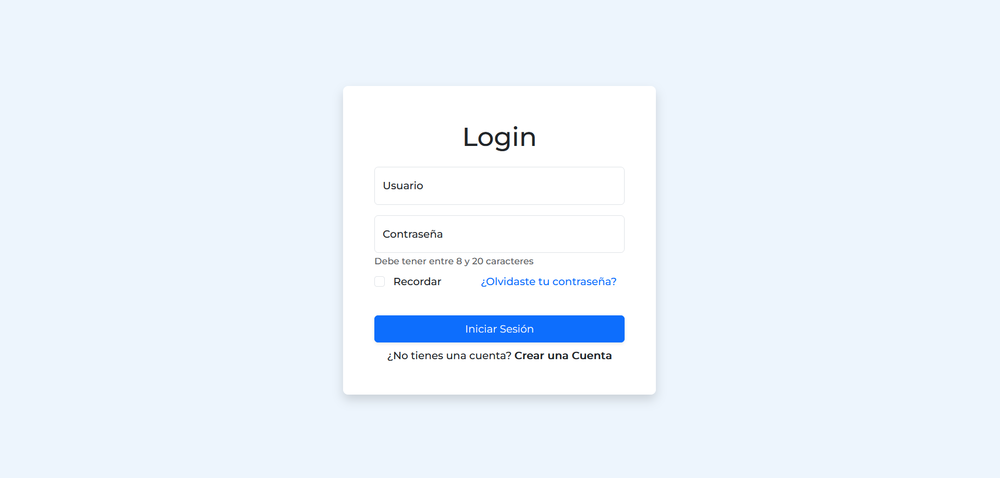

# **Guia de instalación de Bootstrap**

## **Paso 1: Descargar Bootstrap**
Para descargar Bootstrap, puede hacer lo siguiente:

1. Visite el sitio web oficial de [Bootstrap](https://getbootstrap.com/)
2. Haga clic en el botón "Download" en la parte superior de la página
3. Seleccione la versión que desea descargar y haga clic en el botón "Download"

O bien, puede utilizar un CDN para cargar Bootstrap en su sitio web sin necesidad de descargar los archivos. Por ejemplo, puede utilizar el siguiente código para cargar Bootstrap desde un CDN de Google:

```HTML
<link href="https://cdn.jsdelivr.net/npm/bootstrap@5.3.1/dist/css/bootstrap.min.css" rel="stylesheet" integrity="sha384-4bw+/aepP/YC94hEpVNVgiZdgIC5+VKNBQNGCHeKRQN+PtmoHDEXuppvnDJzQIu9" crossorigin="anonymous">

<script src="https://cdn.jsdelivr.net/npm/bootstrap@5.3.1/dist/js/bootstrap.bundle.min.js" integrity="sha384-HwwvtgBNo3bZJJLYd8oVXjrBZt8cqVSpeBNS5n7C8IVInixGAoxmnlMuBnhbgrkm" crossorigin="anonymous"></script>

```
## **Paso 2: Incluir Boostrap en un Proyecto**
Si se opto por descargar los archivos proceda a:
>
>**Descomprime el archivo descargado**
   Una vez descargado, descomprima el archivo .zip. Dentro de la carpeta descomprimida, se encontraran tres carpetas: `css`, `js` y `fonts`.
>
>1. **Incorpora los archivos en tu proyecto**
   Copia las carpetas `css` y `js` en la carpeta de el proyecto.
>
>2. **Vincula los archivos de Bootstrap en tu HTML**
   En el archivo HTML donde quieras usar Bootstrap, necesitas vincular los archivos CSS y JS. Asegúrate de que los archivos estén correctamente vinculados en tu archivo HTML.
>
>Para el CSS, añade esto en la sección `<head>` de el HTML:
>   ```html
>   <link rel="stylesheet" href="ruta/a/bootstrap.min.css">
>   ```
>   Y para el JS, añade esto justo antes del cierre de la etiqueta `</body>`:
>   ```html
>   <script src="ruta/a/bootstrap.min.js"></script>
>   ```
>

Si se uso solamente el CDN, la incorporación de Boostrap estaría completa con la copia del codigo mencionado en la parte superior.

Adicionalmente se puede incluir boostrap mediante un paqute de gestión de dependencias como lo es `npm` o `Yarn` para posteriormente importarlo en el proyecto. Por ejemplo

```
   npm install boostrap
```
```
   import 'bootstrap/dist/css/bootstrap.min.css';
   import 'bootstrap/dist/js/bootstrap.min.js';
```

**Paso 3: Utilizar Boostrap en un Proyecto**
   Luego de haber incluido los archivos necesarios de Boostrap en el proyecto trabajado, se puede comenzar a utilizar las clases y componentes de Boostrap en el `HTML`, `CSS` o `JavaScript`. Por ejemplo:

``` HTML
<!DOCTYPE html>
<html>
   <head>
      <!-- Incluye los archivos de Bootstrap aquí -->
   </head>
   <body>
      <button class="btn btn-primary">Botón de Ejemplo</button>
   </body>
</html>
```

Bootstrap proporciona una serie de propiedades y clases que puedes utilizar para personalizar el aspecto y el comportamiento de tus elementos. Algunas de las propiedades más relevantes incluyen:

- **Grid System:** Bootstrap utiliza un sistema de cuadrícula flexible que te permite crear diseños responsivos fácilmente.

- **Clases de Estilos:** Bootstrap ofrece una amplia gama de clases de estilo que puedes aplicar a elementos HTML para darles formato de manera rápida.

- **Componentes:** Bootstrap incluye una variedad de componentes predefinidos como barras de navegación, carruseles, modales, etc., que puedes personalizar y utilizar.

- **Variables y Temas:** Puedes personalizar los colores, fuentes y otros aspectos visuales de Bootstrap utilizando variables CSS y temas.

- **JavaScript:** Bootstrap incluye JavaScript para mejorar la funcionalidad de tus páginas web, como modales, botones desplegables y más.

Ejemplo de una página utilizando Boostrap

```HTML
<!DOCTYPE html>
<html lang="es">
<head>
    <meta charset="UTF-8">
    <meta name="viewport" content="width=device-width, initial-scale=1.0">
    <title>Ejemplo de Página con Bootstrap</title>
    <!-- Incluye los archivos de Bootstrap -->
    <link href="https://cdn.jsdelivr.net/npm/bootstrap@5.5.0/dist/css/bootstrap.min.css" rel="stylesheet">
</head>
<body>
    <!-- Encabezado de la página -->
    <header class="bg-primary text-white text-center py-3">
        <h1>Mi Página con Bootstrap</h1>
    </header>

    <!-- Contenido principal -->
    <section class="container my-5">
        <h2>Bienvenido a mi página</h2>
        <p>Esta es una página de ejemplo utilizando Bootstrap.</p>
        <button class="btn btn-primary">Botón de Ejemplo</button>
    </section>

    <!-- Pie de página -->
    <footer class="bg-dark text-white text-center py-3">
        &copy; 2023 Mi Página. Todos los derechos reservados.
    </footer>

    <!-- Incluye los archivos de JavaScript de Bootstrap al final del documento -->
    <script src="https://cdn.jsdelivr.net/npm/bootstrap@5.5.0/dist/js/bootstrap.min.js" integrity="sha384-wTf/cgx6G9l2Dj2TbDMfjqLtrtff9I/Cq8p/nzU5+WtTr0p5lPveLElXl1zshj1Pk" crossorigin="anonymous"></script>
</body>
</html>

```

# Login

<p align="center">
    
</p>
